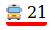

This is a set a web components to make beautiful UI about public transport.

## transport-thumbnail



#### Usage
Import the module on each page that uses the component :

```html
<script src="https://unpkg.com/jungle_bus_web_components@1.0.2/src/transport_thumbnail.js"></script>
```

Then simply use it like any other tag :

```html
<transport-thumbnail
    data-transport-mode="bus" data-transport-line-code="21" data-transport-line-color="red">
</transport-thumbnail>
```

## more to come ...

 :construction:

# Credits
This project has been developed by the [Jungle Bus](http://junglebus.io/) team as part of the [VapourTrail](https://github.com/Jungle-Bus/VapourTrail) project.

The code in this repository is under the GPL-3.0 license.

If you value this work, show your support by donating to the [OSM French local chapter](http://openstreetmap.fr).


